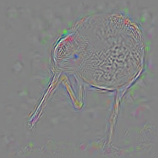

# chainer-desalinet

Chainer implementation of DeConvNet [1] and DeSaliNet [2].
These are the technics that visualize feature maps of each layers of convolutional networks.
Currently, this implementation supports VGGNet and AlexNet.

## Summary

||Input|conv5|fc8|
|:-:|:-:|:-:|:-:|
|DeConvNet||||
|DeSaliNet||||

## Requirements

- Chainer
- Cupy (for GPU support)
- OpenCV

## Usage

### DeConvNet
```
python run.py --input images/bird.png --arch alex --gpu 0
python run.py --input images/bird.png --arch vgg --gpu 0
```

### DeSaliNet
```
python run.py --input images/bird.png --arch alex --mask --gpu 0
python run.py --input images/bird.png --arch vgg --mask --gpu 0
```

## References

- [1] Matthew D. Zeiler and Rob Fergus, "Visualizing and Understanding Convolutional Networks",
https://cs.nyu.edu/~fergus/papers/zeilerECCV2014.pdf
- [2] Aravindh Mahendran and Andrea Vedaldi, "Salient deconvolutional networks",
https://www.robots.ox.ac.uk/~vedaldi/assets/pubs/mahendran16salient.pdf
